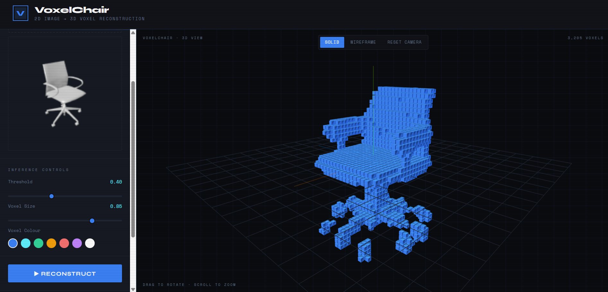
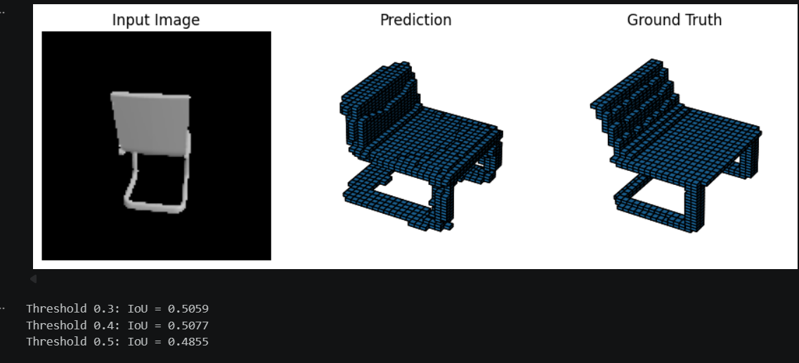

<div align="center">
  <h1>🪑 VoxelChair 2D-to-3D Voxel Reconstruction</h1>
  <p><strong>A Hybrid ResNet Encoder-Decoder Architecture for Single-View to 3D Voxel Generation</strong></p>
  
  [](#)
  [](#)
  [](#)
  [](#)
</div>

---



---

## 📖 Project Overview

VoxelChair is a deep learning pipeline trained on the **ShapeNet dataset** that takes a **ingle RGB image of a chair** and reconstructs its **3D voxel representation (32×32×32)**.. 

By leveraging a custom **Hybrid ResNet Encoder-Decoder Architecture with Latent 3D Representation and Feature-Guided Refinement**, the model learns both the complex geometric mappings and the structural intricacies of 3D topologies purely from monocular 2D images. 

The project includes a fully functional machine learning pipeline (training, testing, inference) alongside a sleek **Flask Web Application** to interactively visualize the 3D reconstructed voxels in your browser.

---

## ✨ Key Features

- **Single-View 3D Reconstruction**: Generates complete 3D volumes from just a single RGB image.
- **Hybrid ResNet34 Encoder + 3D CNN Decoder**
- **Feature-guided refinement (skip injection from 2D → 3D)**
- **Interactive web app with 3D visualization (Three.js)**: Real-time inference with adjustable threshold
- **Advanced training with**:
  - BCE + Dice + Focal Loss
  - Gradient clipping
  - Learning rate scheduling

---

## 🧠 Model Architecture

The model follows a hybrid 2D–3D encoder-decoder design with cross-dimensional feature guidance::

1. **2D ResNet Encoder**:
   Processes a `128×128` RGB image using a ResNet34 backbone to extract hierarchical semantic features.
   Outputs:
     - A 1024-dimensional latent vector
     - Multi-scale feature maps used for refinement
2. **Latent 3D Representation**:
   A dense `1024-dimensional` latent vector that acts as the bridge between the 2D image space and 3D volumetric space.
3. **3D CNN Decoder with Feature-Guided Refinement**:
   Expands the latent vector into a 3D voxel grid using fully connected projection followed by 3D transposed convolutions.
At each upsampling stage, encoder features are projected and injected into the 3D feature maps via global pooling, providing structural guidance and improving reconstruction fidelity.

The final output is a 32×32×32 voxel occupancy probability grid.

---

## 📊 Model Performance

Evaluated on the widely recognized **ShapeNet Core dataset** (Chairs category):

- **Metric**: Intersection over Union (IoU)
- **Score**: **52.0% IoU** on independent Test Data

---



---

## 🛠️ Tech Stack

**Deep Learning Model:**
- PyTorch & Torchvision
- NumPy & Trimesh (for 3D manipulation)
- Scikit-Image

**Backend & Interactive Web App:**
- Flask & Flask-CORS
- Pillow (Image Processing)
- Base64 Encoding stream

**Frontend Visualization:**
- HTML/CSS/Vanilla JS
- Three.js (for rendering interactive voxel structures)

---

## 📂 Repository Structure

```text
.
├── app.py                  # Flask Web App Server (Backend HTTP API)
├── train.py                # Main training loop and validation script
├── test.py                 # Evaluation script for computing Test IoU
├── inference.py            # CLI script to generate 3D voxels from a single image
├── requirements.txt        # Python dependency list
├── configs/                # Configuration and hyperparameter YAML/JSON files
├── outputs/                # Directory storing trained model checkpoints (model_best.pth)
├── src/                    # Source Code Modules
│   ├── models/             # PyTorch Neural Network Definitions
│   │   ├── encoder.py      # ResNet Encoder
│   │   ├── decoder.py      # 3D CNN Decoder
│   │   └── model.py        # Combined ReconstructionModel wrapper
│   ├── data/               # Dataloaders & ShapeNet dataset preparation
│   └── utils/              # Metrics (IoU), plotting, and generic helpers
├── templates/              # HTML frontend for the Flask Web App
├── static/                 # Frontend CSS and JS files
└── notebooks/              # Jupyter notebooks for EDA and prototyping
```

---

## 🚀 Setup & Installation

### 1. Clone the Repository
```bash
git clone https://github.com/yourusername/shapenet-voxel-reconstruction.git
cd shapenet-voxel-reconstruction
```

### 2. Create a Virtual Environment (Optional but Recommended)
```bash
python -m venv venv_shapenet
venv_shapenet\Scripts\activate
```

### 3. Install Dependencies
Ensure you have a CUDA-compatible system for faster training/inference.
```bash
pip install -r requirements.txt
```
### 4. Downloading the Dataset

Before running any scripts or training, ensure the ShapeNet dataset is downloaded and placed inside the `src/data/` directory.
1. Download the ShapeNet dataset (specifically the Chairs category).
2. Extract the dataset such that the main folder sits at `src/data/shapenet/`.

```text
├── src/                    
│   ├── data/
|   |   ├── ShapeNetRendering         # input images
|   |   ├── ShapeNetVox32             # output voxels
```
---

## 🖥️ Usage

### Running the Web Dashboard

We built a frictionless webapp to let you upload images and interact playfully with generated 3D models.

1. Ensure your best trained weights are located at `outputs/model_best.pth`.
2. Start the server:
   ```bash
   python app.py
   ```
3. Open `http://localhost:5000` in your web browser.
4. Upload any chair image and visually explore the 3D voxel footprint magically generated from it! 

### Training the Model from Scratch

Configure your dataset paths and hyperparameters in the `configs/` directory, then start training:

```bash
python train.py 
```
---

## 💡 Future Enhancements

- **Multi-Category Support:** Extending beyond just the Chairs class to Tables, Cars, and Airplanes.
- **Attention Mechanisms:** Infuse Vision Transformers (ViT) into the encoder for more holistic image understanding.

---

## 🤝 Contributing

Contributions, issues, and feature requests are welcome!
Feel free to check [issues page](https://github.com/yourusername/shapenet-voxel-reconstruction/issues).

## 📝 License

This project is [MIT](https://choosealicense.com/licenses/mit/) licensed.